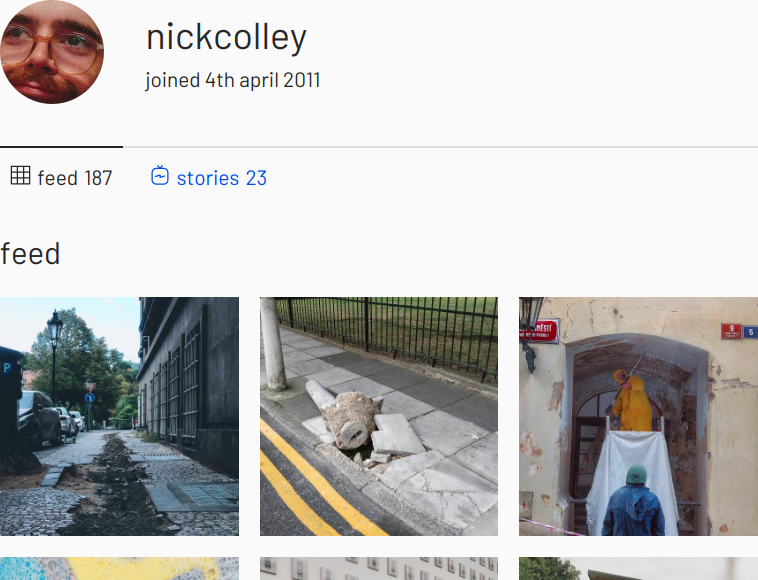

# Instagram Archive Viewer

[](https://github.com/nickcolley/instagram-archive-viewer/actions?query=workflow%3Aci)
[](https://www.npmjs.com/package/instagram-archive-viewer)



View your main instagram feed and stories to a local website from your data download archive.

## Getting started

First, download your [instagram data archive](https://help.instagram.com/contact/163695614321277).

Then run:

```
npx instagram-archive-viewer --input ~/Downloads/username_12345678.zip
```

For all options run:

```
npx instagram-archive-viewer --help
```

## Will this expose my personal details?

This tool only runs on your machine.
It uses your main feed, stories and profile (which contains your email address).

You can also:

- review the source code.
- unzip your archive yourself
- remove any sensitive information

## I want to re-use this for my website

This project is an Eleventy site under the hood.
You can:

1. fork this project
2. remove the `bin` folder.
3. manually copy your archive into the `src/_data` directory.

Note: be careful as your archive contains sensitive information.
By default it will be ignored by `.gitignore` but you may decide some of the already public parts of your archive are safe to commit.

## Development

### Running the project locally on your machine

You'll need Git and Node.js installed.

If you don't have Node.js, try [installing Node Version Manager (NVM)](https://github.com/nvm-sh/nvm#install--update-script) before following the next steps.

#### 1. [Fork the project](https://docs.github.com/en/free-pro-team@latest/github/getting-started-with-github/fork-a-repo)

#### 2. Clone your forked project

```bash
git clone git@github.com:your-username-here/instagram-archive-viewer.git
```

#### 3. Navigate to the project

```bash
cd instagram-archive-viewer
```

#### 4. Install Node.js using nvm (optional)

```
nvm use
```

#### 5. Install dependencies

```
npm install
```

#### 6. Run the site

```
npm start
```
